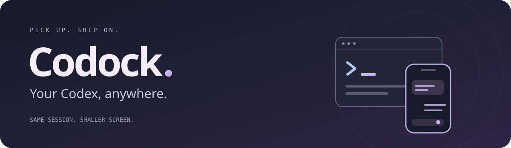
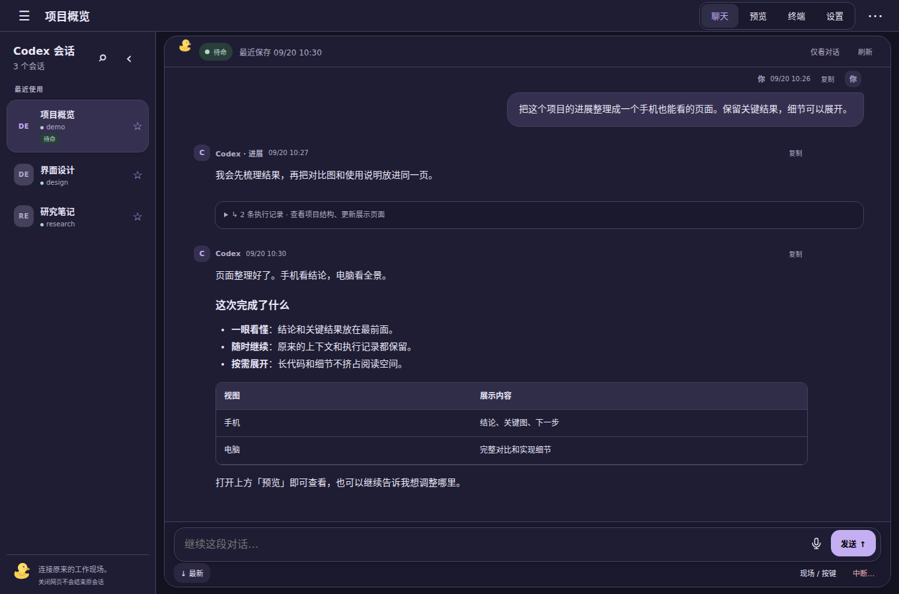
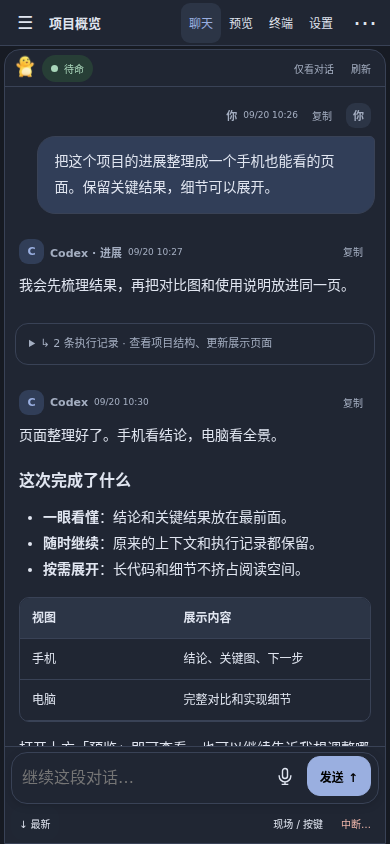
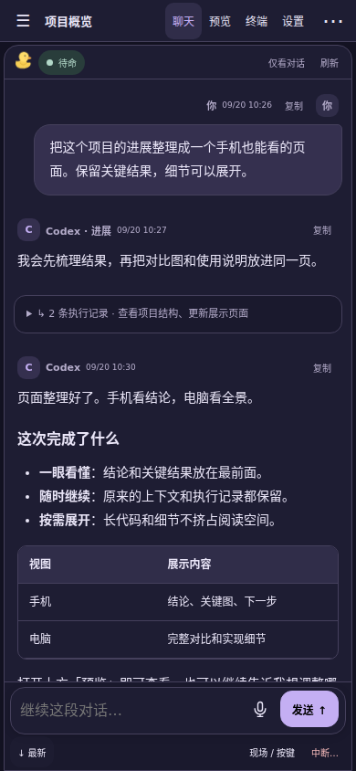
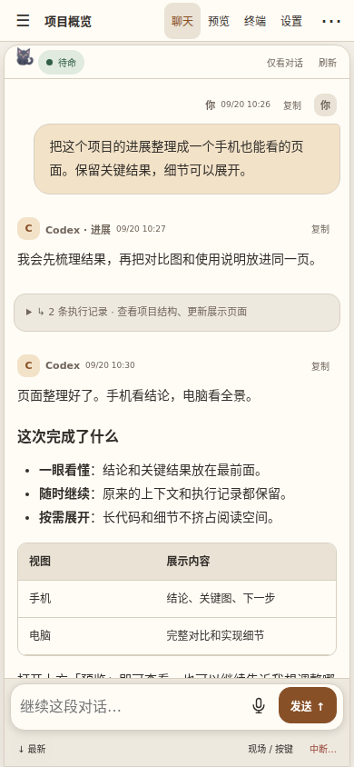
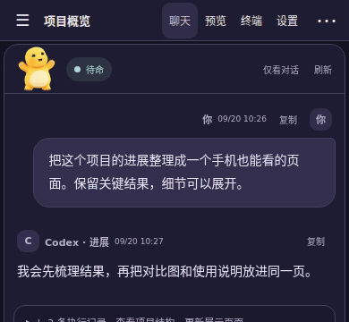
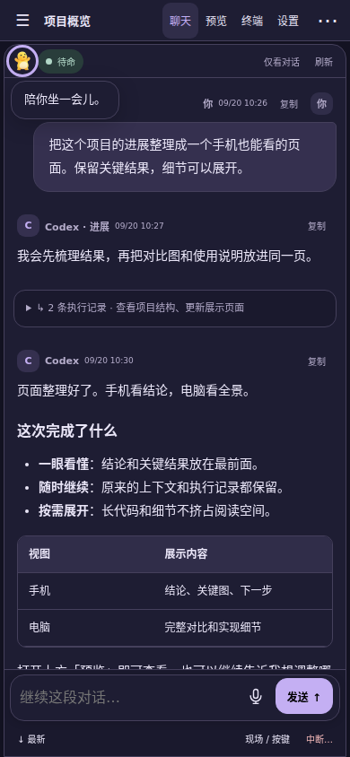

[English](README.md) · 简体中文

把原来的 Codex 装进口袋。 手机接着聊、看执行、操作终端、预览网页，不丢上下文。

<a href="docs/FREE-TRYOUT.md"><strong>免费体验 →</strong></a> · <a href="docs/DEPLOYMENT.md">搭建自己的网址</a> · <a href="docs/USAGE.md">使用与外观</a>

  
  
  

真实界面 · 虚构演示数据

- **接着聊**：原会话、原上下文，执行记录按需展开。
- **随手操作**：中文输入、历史、特殊按键，确认与中断由你决定。
- **直接看成果**：HTML、图片、视频，每个会话一个预览。
- **自己的桌面**：三套配色、四个会动的角色；点一下有动作和气泡，也可关闭。

  
  

点一下，陪你说句话。真实界面交互，动图展示登录页玩偶。

## 开始

已有 Linux 工作机、Node.js 22+、tmux 3.4+、Python 3 和可用的 Codex，会话与应用使用同一非 root 用户。

| 想怎么用                   | 跟着做                                           |
| -------------------------- | ------------------------------------------------ |
| 不买域名，先试聊天和终端   | [免费 HTTPS 网址](docs/FREE-TRYOUT.md)           |
| 固定自有网址＋完整网页预览 | [腾讯云：服务器、域名到上线](docs/DEPLOYMENT.md) |

原生前端，无构建步骤，一个 Node 服务。免费单网址方案不包含独立 HTML 预览。

[架构](docs/ARCHITECTURE.md) · [开发与测试](CONTRIBUTING.zh-CN.md) · [安全](SECURITY.zh-CN.md) · [MIT](LICENSE) · [第三方声明](NOTICE.md)
