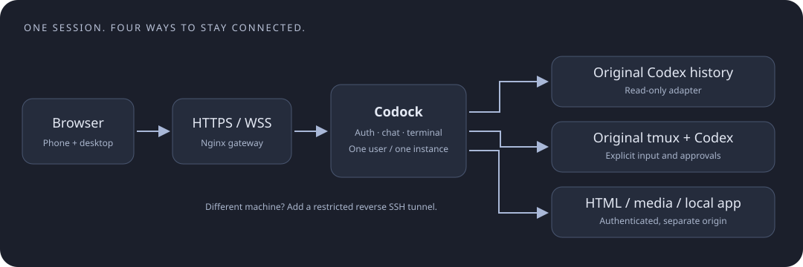

# Architecture and maintenance

English · [简体中文](ARCHITECTURE.md)

## One execution context

HTTPS/WSS connects browsers to one Node service. Chat reads original Codex history; input reaches the original tmux. No second model process. Previews have separate origins but share authenticated authorization. An optional restricted reverse SSH tunnel connects separate gateway/workstation hosts.

| Module                            | Responsibility                                           |
| --------------------------------- | -------------------------------------------------------- |
| `server.mjs`                      | HTTP/WS routes, exact Host/Origin checks, lifecycle      |
| `lib/config.mjs`, `preflight.mjs` | Config, safe rendering, credential validation            |
| `auth.mjs`, `github-auth.mjs`     | Sessions, password/TOTP or single-account GitHub login   |
| `registry.mjs`                    | Allowlist, recreated-session identity, preview bindings  |
| `terminal.mjs`, `history.mjs`     | PTY, write leases, keys, read-only history               |
| `chat.mjs`, `codex-reader.py`     | Process binding, read-only history and activities        |
| `chat-send.mjs`, `chat-input.mjs` | Same-thread delivery, receipts, no ambiguous replay      |
| `preview*.mjs`, `control.mjs`     | Preview authorization, media, owner-only binding API     |
| `public/`                         | Vanilla UI, lazy terminal and on-demand activity details |

Main endpoints: `/api/bootstrap`, `/api/sessions`, `/api/sessions/:name/chat`, `/api/sessions/:name/preview`, `/ws`. Binding commands use an owner-only Unix socket, not public management endpoints.

## Compatibility

The history adapter currently reads `state_5.sqlite`, `thread_history_1.sqlite` and associated legacy JSONL. These are not a stable public SDK. Synthetic tests do not establish compatibility with every Codex version; check thread detection, history, activity, input and approvals before upgrading. Unsupported formats fall back to the terminal rather than guessing a thread or scanning other users.

No official App Server integration, cross-user authorization, complete audit recording or server-side speech recognition. Changing the frontend does not change the model or Codex safety settings. Only supported public conversation/activity is exposed, not private reasoning.

## State

`config.json` stores instance parameters. `runtime/` holds credentials, bindings, recency and receipts, possibly including message text. Login/preview grants are in memory, so restarts require login. tmux survival across browser disconnects does not imply recovery after host replacement.

One process per instance; do not attach several Node replicas to the same socket. Scale with separate users, instances, ports, domains and Codex environments. Untrusted users also need VM/container and network isolation.

## Troubleshoot by layer

| Symptom                  | Check first                                                       |
| ------------------------ | ----------------------------------------------------------------- |
| Whole site times out     | Client DNS/routes, bad AAAA, TLS/firewall, then gateway           |
| Login fails              | Exact OAuth callback, approved numeric ID, outbound GitHub access |
| No sessions              | Linux user, socket, allowlist, recreated identity                 |
| Empty chat               | Codex in the original pane, history format/permissions            |
| Uncertain or failed send | Original input line and receipt; do not blindly paste again       |
| Slow/broken HTML         | Preview DNS/TLS, binding, asset size, hardcoded localhost         |
| No dictated text         | Browser permissions/service, or use keyboard dictation            |

A data-center HTTP 200 is not a phone test. Compare Wi-Fi/cellular, desktop/mobile and proxy routes when relevant; repeated retries do not repair network failures.

## Update, backup, revoke

Back up configuration and necessary runtime data; install with the same Node major, run tests and validate an isolated instance. Roll back using prior source and matching lockfile, without overwriting projects or tmux. Login invalidation after restart is expected.

Encrypt config/runtime backups; manage Codex history and projects separately. Verify paths/users after restore and explicitly rebind changed session identities. To revoke access, stop the instance/tunnel, revoke its OAuth/SSH credentials or change the approved identity and restart. Setup never overwrites credentials: rotate during planned downtime, safely preserve old files, reinitialize and verify. DNS removal alone is not immediate revocation.
