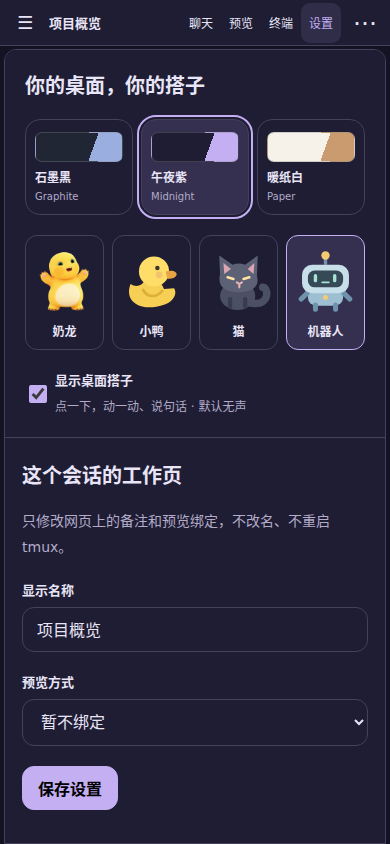

# 使用与适配

[English](USAGE.en.md) · 简体中文

## 继续原会话

打开会话后默认进入聊天。执行动作可展开，或切成“仅看对话”；侧栏按最近使用排序，也能置顶。手机默认收起会话列表，搜索按需打开。

输入框将文字代送到原 Codex 终端并发送 Enter，不创建另一套模型。模型、推理强度、工具、联网和额度均沿用原进程。网页登录身份与 Codex 登录身份相互独立。

“正在运行 / 等待操作 / 待命”来自当前终端提示，不是完整的模型事件流。需要审批、方向选择或中断时，打开“现场 / 按键”核对原画面；不会自动批准。原终端默认只读，显式允许输入后才能发送按键。历史区域可滚动，退出后回到实时。

发送结果不明确时先核对原终端，不要反复点发送。移除失败回执只清理界面，不撤回原终端输入，也不删除 Codex 历史。浏览器听写受权限和识别服务可达性影响；也可使用手机系统键盘听写。

## 配色与角色



设置页分别选择配色（石墨黑、午夜紫、暖纸白）和角色（奶龙、小鸭、猫、机器人）。两者互不绑定，选择存于当前浏览器。登录页和侧栏的玩偶会轻轻呼吸、摇摆或漂浮；点击后有更明显的动作和一句气泡。聊天状态旁也能点击，忙碌和等待确认时使用对应提示；气泡 3.5 秒自动收起，也可点别处或按 Esc 关闭。默认无声，不调用模型、不发送终端按键。角色支持关闭，动画遵循 `prefers-reduced-motion`。

管理员默认值在 `config.json`：

```json
{
  "brand": {
    "name": "Codock",
    "tagline": "Your Codex, anywhere.",
    "preset": "midnight",
    "mascot": true,
    "character": "nailong",
    "accent": null,
    "legalText": ""
  }
}
```

这是配置片段，合并到完整配置中。`preset` 为 `graphite`、`midnight` 或 `paper`；`character` 为 `nailong`、`duck`、`cat` 或 `robot`；`accent: null` 跟随配色，也可填 `#RRGGBB`。自定义强调色会自动选择黑/白按钮文字，但仍需检查链接和状态文字的对比度。更改默认配置需要重启；浏览器已有的外观选择优先。

布局集中在 `public/style.css`，配色集中在 `public/brand.css`，角色与外观设置集中在 `public/theme.js`。不要复制三套前端。当前界面以中文为主，不宣称完整国际化。

## HTML 到手机

在 `projectRoot` 中建立专用展示目录，只放可展示资源。用相对路径引用 CSS、图片和媒体，不要在页面中写死 `127.0.0.1`——那在手机上指手机本身。

在应用目录执行：

```sh
node scripts/run.mjs preview --session dev --directory /srv/codock/projects/reports/demo --entry index.html
```

后台须已启动，调用者须是同一 Linux 用户。成功返回 `ok: true` 和固定会话链接，无须重启或再配 DNS。已有不同项目绑定时拒绝自动覆盖；先让使用者决定，不直接编辑运行中的绑定文件。

可将 [示例页面](../examples/workbench-page/index.html) 复制到专用展示目录。图片和视频在可关闭浮层内打开；移动端视频建议 H.264 MP4、yuv420p、faststart，交付前检查真实编码。

让代理自动完成这一步，可在项目自己的 `AGENTS.md` 中加入并一次性替换路径：

```text
适合可视化的成果生成手机友好的 HTML，资源用相对路径，只放在专用展示目录。
确认当前 tmux 名称，不能猜测或覆盖其他项目绑定。
执行 node /srv/codock/app/scripts/run.mjs preview --session <已确认会话> --directory <展示目录> --entry index.html。
成功后检查资源与交互，直接交付返回链接；不读取凭据或复制 Cookie。
绑定成功不代表手机实际验收通过。
```

## 会话与本地网页

会话由你在原 Linux 环境创建，再加入 `allowed` 并重启服务。网页目前不创建或批量终止 tmux。显示名称可修改，不改 tmux 真实名字。同名会话删除重建后必须确认重绑，旧预览不会悄悄继承。

端口预览默认关闭。确需开发服务器时在 `previewPorts` 加入可信端口，再在设置中绑定；绑定不会启动程序。它不是任意内网代理：HTTP 写方法、复杂登录重定向等不保证兼容。端口服务的 WebSocket 可能执行写操作，因此只允许可信应用，不能加入管理后台、数据库或本服务端口。
